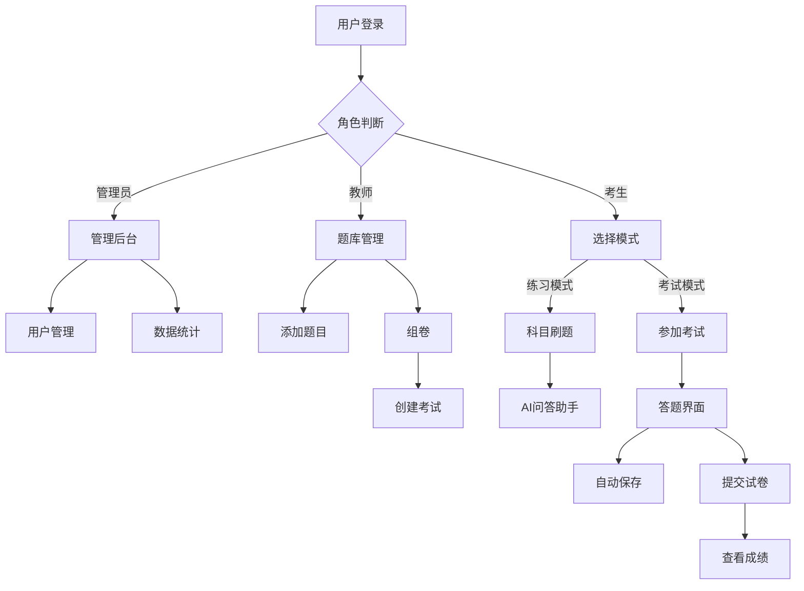

# 在线考试系统产品需求文档

## 1. Product Overview

在线考试系统是一个现代化的Web应用，支持题目管理、组卷考试、AI问答助手等功能，采用多巴胺配色风格设计。

- 解决教育机构和企业在线考试需求，支持大规模并发考试场景，提供完整的题库管理和考试流程，集成AI助手提供智能解题指导。
- 目标是打造一个高性能、易维护的在线考试平台，支持5000人同时在线考试，提供个性化学习体验。

## 2. Core Features

### 2.1 User Roles

| Role | Registration Method | Core Permissions |
|------|---------------------|------------------|
| 管理员 | 系统预设账号 | 系统全部功能管理，用户管理，数据统计 |
| 教师 | 管理员创建账号 | 题目管理，组卷，考试管理，成绩查看 |
| 考生 | 批量导入或注册 | 参加考试，查看成绩，练习刷题，AI问答 |

### 2.2 Feature Module

我们的在线考试系统包含以下主要页面：

1. **登录页面**：用户身份验证，角色识别，多巴胺配色界面。
2. **管理后台**：系统管理，用户管理，数据统计，权限控制。
3. **题库管理页面**：题目增删改查，批量导入，网络采集，科目分类。
4. **组卷页面**：试卷创建，题目选择，参数设置，智能组卷。
5. **考试管理页面**：考试创建，时间设置，考生分配，监控管理。
6. **答题页面**：考试界面，题目展示，AI问答助手，进度保存。
7. **成绩页面**：成绩查看，统计分析，导出功能，错题分析。

### 2.3 Page Details

| Page Name | Module Name | Feature description |
|-----------|-------------|---------------------|
| 登录页面 | 身份验证 | 支持用户名密码登录，角色自动识别，记住登录状态，多巴胺配色设计 |
| 管理后台 | 用户管理 | 创建教师和考生账号，权限分配，账号状态管理，批量操作 |
| 管理后台 | 数据统计 | 考试数据统计，成绩分析，系统使用情况监控，可视化图表 |
| 题库管理页面 | 题目管理 | 支持单选、多选、判断、简答四类题目的增删改查，富文本编辑 |
| 题库管理页面 | 批量导入 | Excel文件批量导入题目，模板下载，错误提示，进度显示 |
| 题库管理页面 | 网络采集 | 从互联网采集题目，支持多个题库网站，自动解析，去重处理 |
| 题库管理页面 | 科目分类 | 按科目对题目进行分类管理，支持多级分类，标签系统 |
| 组卷页面 | 试卷创建 | 手动选题或按科目自动组卷，设置题目数量和分值，预览功能 |
| 组卷页面 | 参数设置 | 考试时长，开始结束时间，答题模式设置，防作弊配置 |
| 考试管理页面 | 考试创建 | 创建考试，分配考生，设置考试规则，发布管理 |
| 考试管理页面 | 时间管理 | 支持单独或批量为考试加时，考试状态监控，实时提醒 |
| 答题页面 | 界面布局 | 左右布局设计，左侧题目导航，右侧题目内容和选项，响应式适配 |
| 答题页面 | 答题控制 | 上一题下一题导航，题目标记，答题状态显示，快捷键支持 |
| 答题页面 | 进度保存 | 15-30秒自动保存答题进度，防止数据丢失，断网恢复 |
| 答题页面 | 考试提醒 | 15分钟结束提醒，15分钟内禁止提前交卷，倒计时显示 |
| 答题页面 | AI问答助手 | 练习模式下提供"问AI"按钮，获取解题思路、答案和考点分析，智能对话 |
| 答题页面 | 网络监控 | 断网检测和提示，自动重连机制，离线缓存 |
| 答题页面 | 题目预加载 | 先获取题目ID列表，每次预加载10个题目，提升性能，懒加载 |
| 答题页面 | 防抖节流 | 使用Lodash实现防抖节流，优化用户操作体验，减少服务器压力 |
| 成绩页面 | 成绩查看 | 考试成绩展示，错题分析，答题统计，排名显示 |
| 成绩页面 | 数据导出 | 成绩导出Excel，统计报表生成，多格式支持 |

## 3. Core Process

**管理员流程：** 登录系统后进入管理后台，创建教师和考生账号，监控系统运行状态和数据统计，管理系统配置。

**教师流程：** 登录后进入题库管理，通过批量导入或网络采集添加题目，按科目分类管理。然后进入组卷页面创建试卷，设置考试参数。最后在考试管理页面创建考试，分配考生并监控考试进度。

**考生流程：** 登录后可以选择练习模式按科目刷题（可使用AI问答助手），或参加正式考试。在答题页面按照题目顺序答题，系统自动保存进度。考试结束后查看成绩和错题分析。

## 4. User Interface Design

### 4.1 Design Style

- 主色调：多巴胺配色风格 - 明亮的粉色(#FF6B9D)、橙色(#FF8E53)、黄色(#FFD93D)、绿色(#6BCF7F)、蓝色(#4D96FF)、紫色(#9B59B6)
- 按钮样式：圆角按钮，悬停渐变效果，适度阴影，多巴胺色彩搭配
- 字体：现代无衬线字体，标题18px，正文14px，按钮16px
- 布局风格：卡片式设计，充分留白，层次分明，现代化界面
- 动效：适度的过渡动画，加载动效，微交互，提升用户体验

### 4.2 Page Design Overview

| Page Name | Module Name | UI Elements |
|-----------|-------------|-------------|
| 登录页面 | 登录表单 | 居中卡片布局，多巴胺渐变背景，输入框圆角设计，登录按钮彩色渐变 |
| 管理后台 | 导航菜单 | 左侧侧边栏，多巴胺色彩图标，悬停效果，面包屑导航，现代化设计 |
| 题库管理页面 | 题目列表 | 表格布局，分页组件，搜索筛选，操作按钮色彩区分，卡片式展示 |
| 组卷页面 | 题目选择 | 左右分栏，拖拽选题，实时预览，进度条显示，多巴胺配色 |
| 答题页面 | 题目导航 | 左侧网格布局，题号方块，状态色彩：未答(灰色)、已答(绿色)、标记(橙色) |
| 答题页面 | 题目内容 | 右侧主体区域，题目卡片，选项按钮，AI问答按钮，导航按钮 |
| 答题页面 | AI问答助手 | 悬浮对话框，智能图标，多巴胺配色，动画效果，聊天界面 |
| 成绩页面 | 成绩展示 | 卡片式布局，图表展示，色彩编码，动画效果，数据可视化 |

### 4.3 Responsiveness

采用响应式设计，桌面端优先。移动端适配：导航菜单折叠，答题页面上下布局，触摸优化，手势支持。使用CSS Grid和Flexbox实现自适应布局，确保在各种设备上都有良好的用户体验。