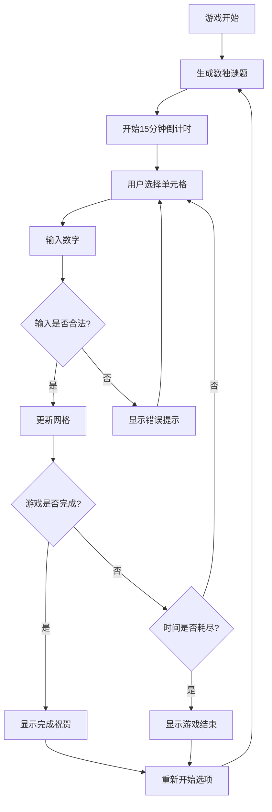

## 1. Product Overview
数独游戏是一个基于Web的经典数字逻辑游戏，采用多巴胺配色风格设计，为用户提供简洁优雅的游戏体验。
- 解决用户对休闲益智游戏的需求，提供9x9标准数独谜题，帮助用户锻炼逻辑思维能力。
- 目标是打造一个界面简洁、操作流畅的在线数独游戏平台。

## 2. Core Features

### 2.1 User Roles
本产品无需用户角色区分，所有用户均可直接使用全部功能。

### 2.2 Feature Module
我们的数独游戏包含以下主要页面：
1. **游戏主页面**：数独网格、数字输入面板、游戏控制按钮、计时器显示。

### 2.3 Page Details

| Page Name | Module Name | Feature description |
|-----------|-------------|---------------------|
| 游戏主页面 | 数独网格 | 显示9x9数独网格，支持点击选择单元格，高亮显示选中状态，区分预填数字和用户输入数字 |
| 游戏主页面 | 数字输入面板 | 提供1-9数字按钮和删除按钮，点击数字填入选中单元格，支持键盘输入 |
| 游戏主页面 | 游戏控制区 | 包含重新开始按钮、暂停/继续按钮，重置游戏状态和计时器 |
| 游戏主页面 | 计时器显示 | 显示15分钟倒计时，时间到达0时游戏结束，实时更新剩余时间 |
| 游戏主页面 | 游戏状态提示 | 显示游戏进度、错误提示、完成祝贺信息 |

## 3. Core Process
用户进入游戏后，系统自动生成一个数独谜题并开始15分钟倒计时。用户点击空白单元格选中后，通过数字面板或键盘输入数字。系统实时验证输入的合法性，错误输入会有视觉提示。用户可随时点击重新开始按钮生成新谜题。当所有单元格正确填写完成或时间耗尽时，游戏结束并显示相应提示。

## 4. User Interface Design
### 4.1 Design Style
- 主色调：多巴胺配色风格 - 明亮的粉色(#FF6B9D)、橙色(#FF8E53)、黄色(#FFD93D)、绿色(#6BCF7F)、蓝色(#4D96FF)、紫色(#9B59B6)
- 按钮样式：圆角矩形按钮，悬停时有渐变效果和轻微阴影
- 字体：使用现代无衬线字体，主要文字16px，按钮文字14px，标题20px
- 布局风格：居中卡片式布局，充分利用空白空间，营造简洁感
- 图标风格：使用简洁的线性图标，配合多巴胺色彩

### 4.2 Page Design Overview

| Page Name | Module Name | UI Elements |
|-----------|-------------|-------------|
| 游戏主页面 | 数独网格 | 9x9网格布局，每个单元格40x40px，3x3子网格用深色边框分隔，选中单元格高亮显示多巴胺色彩，预填数字用深灰色，用户输入用鲜艳色彩 |
| 游戏主页面 | 数字输入面板 | 水平排列的1-9数字按钮和删除按钮，每个按钮采用不同的多巴胺色彩，圆角设计，点击有动画效果 |
| 游戏主页面 | 游戏控制区 | 重新开始和暂停按钮使用对比色设计，位于页面顶部右侧，图标+文字组合 |
| 游戏主页面 | 计时器显示 | 大号数字显示剩余时间，采用渐变色彩，时间紧急时变为红色警告 |
| 游戏主页面 | 游戏状态提示 | 使用卡片式弹窗显示提示信息，背景半透明，文字居中，配合动画效果 |

### 4.3 Responsiveness
产品采用桌面优先设计，同时适配移动端。在移动设备上，数独网格和按钮会适当缩放，保持良好的触摸体验。支持触摸操作优化，包括长按和滑动手势。